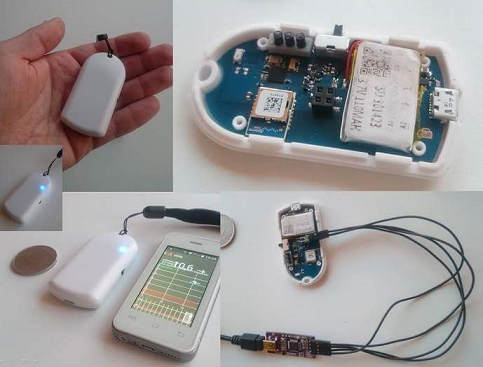

### What is this?
The nRFdrip acts as a bridge between a Dexcom G4 CGM sensor and your Android phone. It shares the similar functionality as the classic [xDrip], but the nRFdrip is a bridge based on different hardware.
The main focus and target when developing nRFdrip was to make a bridge that could fit your pocket, be reliable and run for many days without the need of charging. 

- [Inside nRFdrip](pages/inside.html) - An overview of what it looks like inside
- [Project on gitHub](https://github.com/mrzign/nRFdrip) - Source code and resources
- [Instructions on Getting Started](https://github.com/mrzign/nRFdrip/wiki) - Start here

------

**DISCLAIMER**

All information, thought, and code described here is intended for informational and educational purposes only. Use of code from github.com is without warranty or support of any kind.
Each element of the system can fail at any time rendering the system unusable.

This is not a project of the Dexcom company. It is purely a DIY project.

**Do not use any of the information or code to make medical decisions.**

[xDrip]: http://stephenblackwasalreadytaken.github.io/xDrip/
