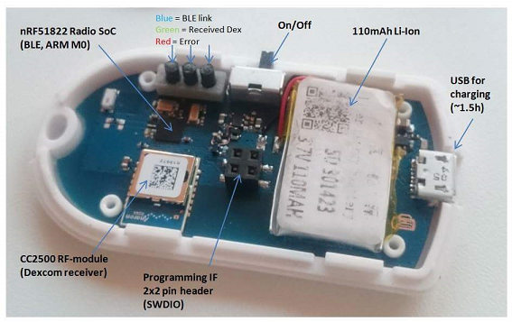

### Inside nRFdrip

The main hardware inside nRFdrip consists of two parts
* A small, but powerful, 32-bit ARM M0 CPU with integrated Bluetooth 4.0 support (nRF51822)
* A proprietary RF module (CC2500) that is used to receive the Dexcom G4 sensor data. 

The benefits of using nRF51822 are many. It is not just very small and powerful, it gives you the freedom to control the Bluetooth protocol implementation
and it is know for its extreme low power modes. The CC2500 is a simple RF receiver also know for extreme low power modes. 

The battery inside nRFdrip is charged via a standard micro-USB connector, used by most modern cell phones, and can last for **more than a week!**

There are three LEDs used for status indication (Blue, Green and Red) that are lit up shortly each time data is received.

The nRFdrip can be flashed and debugged via a standard 4-wire JLINK debugger.

Further hardware design details can be found on [GitHub](https://github.com/mrzign/nRFdrip/tree/master/Resources) 

- [Back To Main Page](../index.html)
- [Source code](https://github.com/mrzign/nRFdrip)
- [Instructions on Getting Started](https://github.com/mrzign/nRFdrip/wiki)

